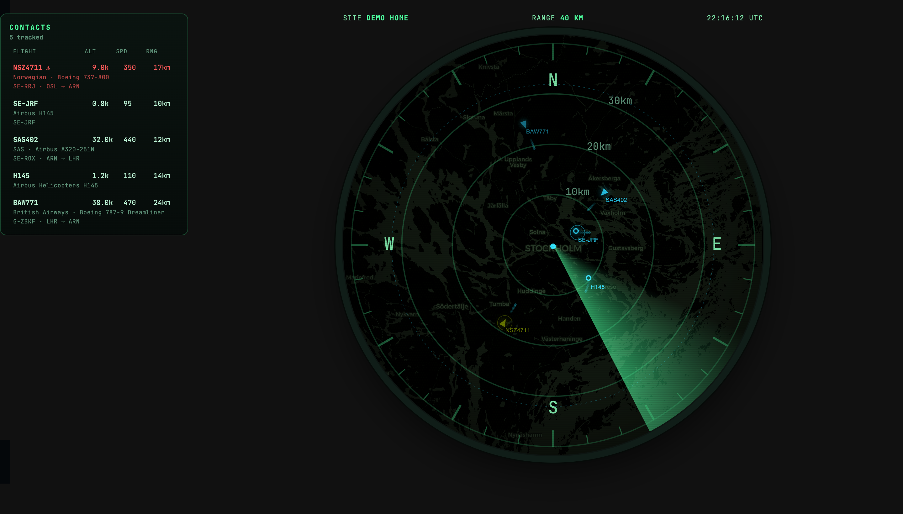

# Flightradar Radar Card

A round, retro radar-scope Lovelace card for Home Assistant that displays live
flights from the [AlexandrErohin/home-assistant-flightradar24](https://github.com/AlexandrErohin/home-assistant-flightradar24)
integration — phosphor sweep, blip decay, dark map underlay, and an ATC-style
contacts board.



## Features

- Round CRT-style scope: rotating sweep beam, phosphor blip decay (pings fire
  exactly when the beam passes), scanlines, vignette, bezel with compass and
  range rings
- Dark Leaflet basemap (CARTO tiles), tinted to match the theme
- Live aircraft blips with heading, callsign, and trails (line or
  phosphor-dot style); smooth dead-reckoned motion between sensor updates
- Contacts board: altitude/speed/range plus airline, model, registration and
  route; click a row or a blip to select — shows an ATC data tag on the scope
  and the aircraft photo in the panel
- Helicopters drawn as circle glyphs (detected from aircraft type)
- Privacy-blocked aircraft identified by type (no "BLOCKED" labels) with
  stable anonymous tracks
- Emergency squawks (7700/7600/7500) paint red, pulse, and sort first
- Lost contacts coast on dead reckoning (dimmed) for `linger_time` before
  removal, so momentary signal dropouts don't blink blips away
- Themes: `green`, `amber`, `blue`
- Sizes itself to the dashboard column **and** the screen height (wall-tablet
  friendly, works in old Android WebViews); proximity alert, startup
  animation, ring labels, and more — all configurable
- Visual config editor with every option; running version shown in the map
  attribution corner

## Installation

### HACS (recommended)

Until the card is in the HACS default store, add it as a custom repository:

1. HACS → ⋮ (top right) → **Custom repositories**
2. Repository: `https://github.com/Ehrenholm/flightradar-radar-card`,
   type: **Dashboard** → Add
3. Search for **Flightradar Radar Card** in HACS and install it
4. HACS registers the dashboard resource automatically — just reload your
   browser when prompted

Updates then appear in HACS like any other card, with correct cache-busting
(no manual version juggling).

### Manual

1. Download `flightradar-radar-card.js` from the
   [latest release](https://github.com/Ehrenholm/flightradar-radar-card/releases/latest)
   and copy it to your Home Assistant `config/www/` folder.
2. Settings → Dashboards → ⋮ → Resources → Add resource:
   - URL: `/local/flightradar-radar-card.js?v=1` — bump the `?v=` number on
     every update to defeat caches (the running version is shown in the
     map's bottom-right corner)
   - Type: **JavaScript module**
3. On tablets running the companion app, use Settings → Companion app →
   Troubleshooting → *Reset frontend cache* after updating if the version
   in the corner looks stale.

### Add the card

It appears in the card picker as "Flightradar Radar Card", or via YAML:

```yaml
type: custom:flightradar-radar-card
entity: sensor.flightradar24_current_in_area
radius_km: 10          # match the radius configured in the FR24 integration
```

## Options

| Option | Default | Description |
| --- | --- | --- |
| `entity` | — (required) | FR24 "current in area" sensor |
| `radius_km` | `40` | Scope range; match your FR24 integration radius (not readable from the sensor) |
| `latitude` / `longitude` | HA home | Scope center |
| `site_label` | HA location name | Top-left readout text |
| `contacts_position` | `right` | `right` \| `left` \| `bottom` \| `none` |
| `theme` | `green` | `green` \| `amber` \| `blue` |
| `map_brightness` | `0.55` | 0–1.5, higher = more visible basemap |
| `sweep_period` | `4` | Seconds per sweep revolution (blip decay follows) |
| `trail_length` | `7` | Past positions kept per aircraft (≈ scan interval × N of history) |
| `trail_style` | `line` | `line` \| `dots` (phosphor afterglow dots) |
| `smooth_motion` | `true` | Dead-reckon blips between sensor updates |
| `linger_time` | `45` | Seconds a dropped contact coasts (dimmed) before removal |
| `max_diameter` | `0` | Pixel cap on scope size (0 = fill the column) |
| `fit_height` | `true` | Also cap the scope to the screen height |
| `height_offset` | `150` | Pixels reserved for the HA header when fitting height (≈40 in kiosk mode) |
| `show_details` | `true` | Airline/model/registration/route rows in contacts |
| `show_photo` | `true` | Aircraft photo for the selected contact |
| `show_ring_labels` | `true` | Kilometre labels on the range rings |
| `startup_animation` | `true` | Scope warm-up fade on load |
| `alert_distance_km` | `0` | Pulse blips closer than this (0 = off) |
| `debug` | `false` | On-screen viewport/size diagnostics |

## Notes

- The FR24 integration only filters by its configured radius (bounding box)
  and min/max altitude — if an aircraft you see on flightradar24.com is
  missing here, check those integration options first (Developer tools →
  States → the sensor's `flights` attribute shows exactly what the card
  receives).
- Wall displays: use a Panel view, and in kiosk mode set `height_offset: 40`.
